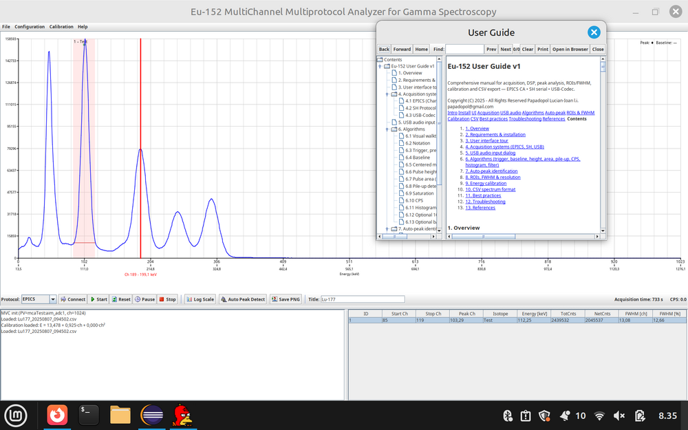
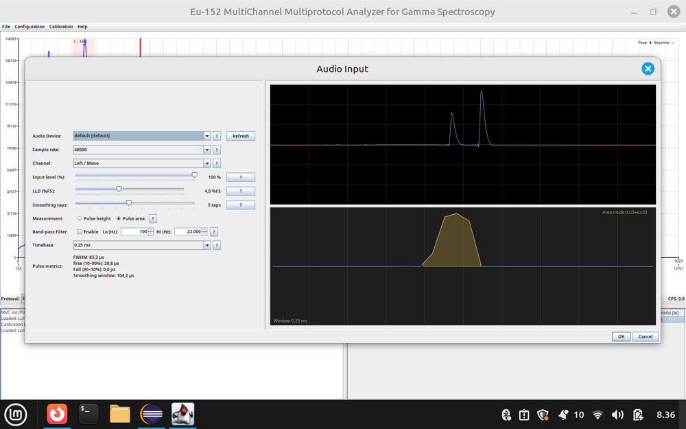
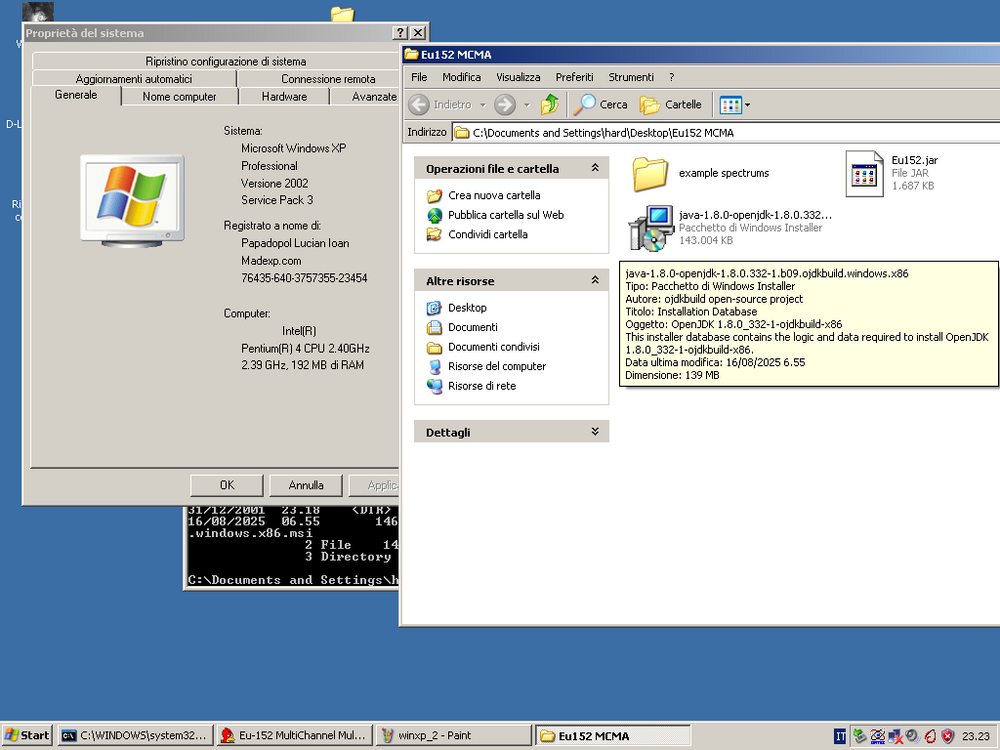
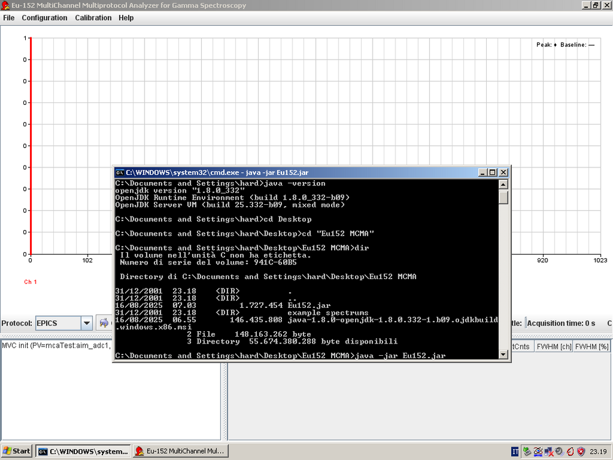
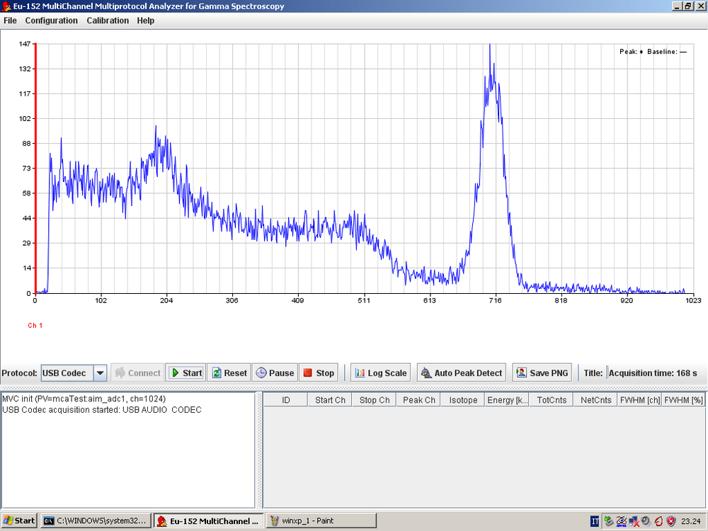

 
# Eu-152 — Cross-platform Gamma Spectroscopy Desktop App
Eu-152 is a no-frills desktop application for gamma spectroscopy. One consistent UI and one analysis pipeline from pulses to a calibrated spectrum. No Python. No web UI. Just a standard executable JAR you can double-click and use.

- Runs on Windows, Linux, and macOS
- Works on Raspberry Pi
- Backward-compatible build for Windows XP SP3 (Java 8)

---

## Table of contents

- [Overview](#overview)
- [Supported inputs](#supported-inputs)
- [Why Eu-152](#why-eu-152)
- [Downloads](#downloads)
- [Requirements](#minimum-requirements)
- [How to run](#how-to-run)
- [Quick start: USB audio](#quick-start-usb-audio)
- [Features in detail](#features-in-detail)
- [Current status and roadmap](#current-status-and-roadmap)
- [Screenshots](#screenshots)
- [Contact and feedback](#contact-and-feedback)
- [License](#license)

---

## Overview

Eu-152 provides a consistent workflow whether you acquire via EPICS, a simple serial protocol, or plain USB audio. Create ROIs, run auto-peak to seed candidates, refine them, calibrate using known lines (for example Eu-152), and export your results. It is written entirely in Java: if your system runs Java, it runs Eu-152.

---

## Supported inputs

1) EPICS Channel Access  
   - Example: connect a Canberra 556AIM in your NIM crate and expose it via EPICS. 
I strongly suggest you to read the Nuclear Physics Lab "NPL" blog about this: [Amateur Camberra spectroscopy](http://www.nuclearphysicslab.com/npl/npl-home/spectroscopy/software_and_hardware/diy-canberra-system/) 

2) Simple SH-Protocol v2 over serial  
   - Example: Atom Spectra devices.

3) Plain USB audio (PCM) devices  
   - Example: Theremino, Gamma Spectacular, and high-resolution USB codec devices such as "Cubino" and experimental boards.

---

## Why Eu-152

- Same workflow across lab gear (EPICS), bench serial devices, and sound cards at home.
- Portable JAR, zero complex installation.
- Practical defaults with full manual control when you need it.
- Focus on the job, not on themed UIs or arbitrary constraints.

---

## Downloads
- Stable and also backward-compatible build for all kind of systems (Java 8):  
from here, on GitHub or from my Google Drive, link below.
[Download Link Eu-152](https://drive.google.com/file/d/1mcc90R8HlZffilprH9flhV1MmWTFNG62/view?usp=sharing) 

- OpenJDK for WindowsXP legacy Java installer:
[Download OpenJDK 1.8 Windows legacy](https://drive.google.com/file/d/1sPy953caLw_NI2v_q8BpZ12EZcA1DtF-/view?usp=sharing) 

---

## Minimum requirements

Modern and Legacy systems:

- 32 or 64-bit Java 8 on Windows, macOS, or Linux.
Raspberry Pi:
- Works with OpenJDK from 1.8

---

## How to run

On Linux and Raspberry Pi:
```bash
java -jar Eu152.jar
```

On Windows and macOS:
- Double-click `Eu152.jar`.

- If it does not open, install OpenJDK 1.8

Sometimes even on windows you should start it from command line with:
```
java -jar Eu152.jar
```

---

## Quick start: USB audio

1) Pick device, sample rate, and channel (L/Mono or R).  
2) Set input level as high as possible without clipping.  
3) Set LLD around 4–6 percent of full scale to suppress baseline noise.  
4) Choose smoothing taps close to the pulse width shown in the preview.  
5) If you see activity piling up near channel 0, enable the band-pass filter and raise LLD a bit.  
6) For clean, symmetric pulses, Height is precise; for noisy or slightly distorted pulses, Area is often more stable.  
7) Use the two oscilloscopes in the settings window to tune parameters (trial and error is expected).

---

## Features in detail

USB codec acquisition path:

- Trigger with LLD
- Baseline estimation
- Optional band-pass prefilter
- Smoothing
- Pulse height and area measurement
- Pile-up and saturation rejection
- CPS calculation
- Histogramming to 1024 bins

Common analysis tools (all protocols):

- ROI management with totals and net counts
- Auto-peak to seed candidates
- FWHM calculator
- Energy calibration (linear or quadratic)
- Save/load energy calibration as a separate file
- PNG export
- Portable CSV format for loading and saving spectra
- Printing with a clean ROI table on the second page

---

## Current status and roadmap

Current:

- Acquisition (EPICS, SH serial, USB audio)
- ROIs, auto-peak, calibration
- PNG and CSV export
- Printing with well-formatted ROI table

Planned:

- More hobby protocols (community suggestions welcome)
- Self-sizing and arrangement to improve behavior across DPIs and screen sizes
- Documentation refinements based on user feedback
- GitHub project page content expansion

---

## Screenshots

 
 
 
 
 

---


## Contact and feedback

If you test Eu-152 with your setup (EPICS, SH serial, or USB audio), please share:

- Notes on your configuration
- Hardware description
- Screenshots or saved spectra files
- Parameters that worked well for your hardware

Your feedback helps set smarter defaults and prioritize improvements.

Mail to: [l.i.papadopol@gmail.com](mailto:l.i.papadopol@gmail.com) 

---

## License

At the moment this is a closed source project cause will become - probably - my thesis project. I'll set it open source when thesis will be published. 

---
